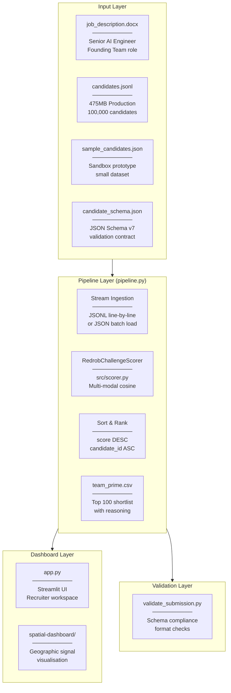
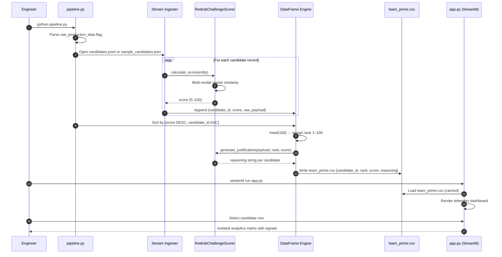
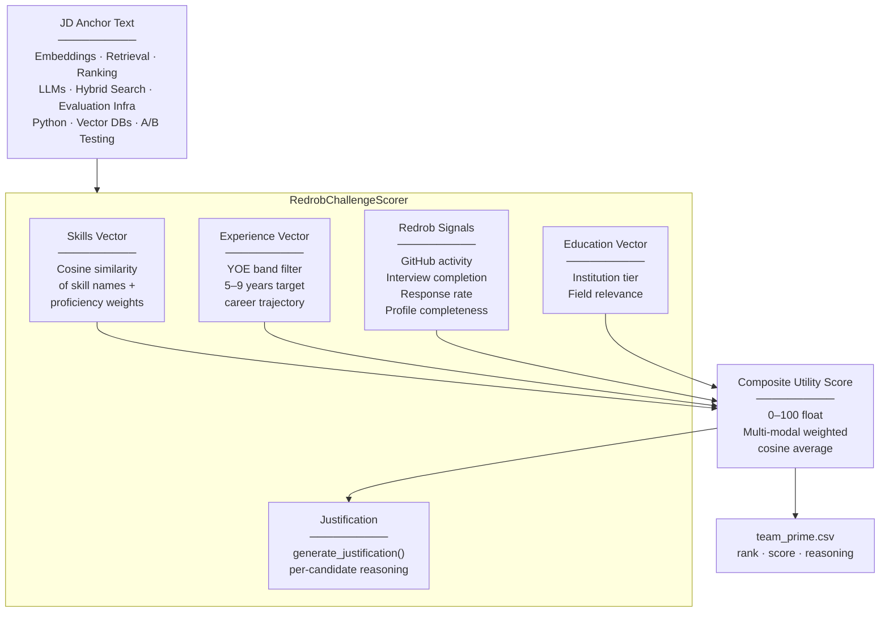

<div align="center">

# ⚡ Redrob Intelligence Matrix

### AI-powered candidate ranking engine for Redrob's Founding Team Matcher challenge.
### Multi-modal cosine scoring pipeline over 100,000 candidates — with a live Streamlit recruiter dashboard.

[](https://python.org/)
[](https://pandas.pydata.org/)
[](https://scikit-learn.org/)
[](https://streamlit.io/)
[](https://docs.pydantic.dev/)

**[📂 Repo](https://github.com/Piyush-Jhajhria/redrob-intelligence-matrix)** • **[🐛 Report Issue](https://github.com/Piyush-Jhajhria/redrob-intelligence-matrix/issues)**

</div>

---

## 📋 Table of Contents

- [Overview](#-overview)
- [System Architecture](#-system-architecture)
- [Pipeline Flow](#-pipeline-flow)
- [Scoring Architecture](#-scoring-architecture)
- [Streamlit Dashboard](#-streamlit-dashboard)
- [Candidate Schema](#-candidate-schema)
- [Tech Stack](#-tech-stack)
- [Quick Start](#-quick-start)
- [Project Structure](#-project-structure)
- [Output Format](#-output-format)

---

## 🔍 Overview

Redrob Intelligence Matrix is a submission for the **Redrob Intelligent Candidate Discovery & Ranking Challenge**. It implements a multi-modal, cosine-similarity-based scoring pipeline that ranks candidates against a Senior AI Engineer job description targeting founding-team archetypes.

The system processes a pool of up to 100,000 candidates, extracts multi-dimensional signals, computes a composite utility score, outputs the top 100 as `team_prime.csv`, and surfaces results in a luxury Streamlit recruiter dashboard.

| What it does | How |
|---|---|
| 🧠 **Multi-modal Scoring** | Cosine similarity across skills, experience, signals and career vectors |
| 📊 **100K Candidate Processing** | Stream-based JSONL ingestion to preserve RAM efficiency |
| 🏆 **Top-100 Shortlist** | Monotonic sort by score, tie-broken by `candidate_id` ascending |
| 🖥️ **Recruiter Dashboard** | Streamlit `app.py` with live leaderboard and per-candidate telemetry |
| ✅ **Submission Validation** | `validate_submission.py` checks format against official schema |
| 🗺️ **Spatial Dashboard** | Separate `spatial-dashboard/` module for geographic signal visualisation |

---

## 🏗️ System Architecture



---

## 🔄 Pipeline Flow



---

## 🧠 Scoring Architecture

The `RedrobChallengeScorer` in `src/scorer.py` evaluates each candidate across multiple signal dimensions against the JD anchor for a **Senior AI Engineer — Founding Team** role.



### Scoring Dimensions

| Dimension | Signals Used | Weight |
|---|---|---|
| **Skills Match** | Skill names, proficiency level, endorsements, duration months | High |
| **Experience Band** | Years of experience (target: 5–9 YOE), career history depth | High |
| **Technical Vitality** | `github_activity_score` (0–100, -1 if not linked) | Medium |
| **Platform Engagement** | Interview completion rate, recruiter response rate, open-to-work flag | Medium |
| **Profile Quality** | Profile completeness score, verified email/phone, LinkedIn connected | Low |
| **Education** | Institution tier (`tier_1`→`tier_4`), field of study relevance | Low |

---

## 🖥️ Streamlit Dashboard

`app.py` renders a luxury, next-gen recruiter workspace over the `team_prime.csv` output.

### Dashboard Sections

| Section | What it shows |
|---|---|
| **Telemetry Header** | Processing footprint (100K pools), cascade funnel (Top 100), YOE band (5–9), scoring engine |
| **Live Leaderboard** | Interactive `st.dataframe` with `rank`, `candidate_id`, `score`, `reasoning` — single-row selectable |
| **Isolated Analytics Matrix** | Per-candidate deep-dive: composite score, recruiter justification, structural metadata |
| **Metadata Profile** | Current title, org size, YOE, notice period, interview attendance rate, GitHub activity weight |

### Run the Dashboard

```bash
# First generate the shortlist
python pipeline.py

# Then launch the dashboard
streamlit run app.py
```

---

## 📐 Candidate Schema

Each candidate record follows `candidate_schema.json` (JSON Schema Draft-07). Key sections:

### Top-level Structure

```json
{
  "candidate_id": "CAND_0000001",
  "profile": { ... },
  "career_history": [ ... ],
  "education": [ ... ],
  "skills": [ ... ],
  "certifications": [ ... ],
  "languages": [ ... ],
  "redrob_signals": { ... }
}
```

### `profile` Fields

| Field | Type | Description |
|---|---|---|
| `candidate_id` | `string` | Format: `CAND_XXXXXXX` (7 digits) |
| `years_of_experience` | `number` | 0–50 |
| `current_title` | `string` | Current job title |
| `current_company_size` | `enum` | `1-10` → `10001+` |
| `headline` | `string` | One-line professional headline |

### `skills` Item

| Field | Type | Description |
|---|---|---|
| `name` | `string` | Skill name |
| `proficiency` | `enum` | `beginner` / `intermediate` / `advanced` / `expert` |
| `endorsements` | `integer` | Count of endorsements received |
| `duration_months` | `integer` | Months of usage |

### `redrob_signals` Key Fields

| Field | Type | Description |
|---|---|---|
| `github_activity_score` | `number` | 0–100 (-1 if no GitHub linked) |
| `interview_completion_rate` | `number` | 0.0–1.0 fraction |
| `notice_period_days` | `integer` | 0–180 days |
| `open_to_work_flag` | `boolean` | Currently open to opportunities |
| `profile_completeness_score` | `number` | 0–100 percentage |
| `recruiter_response_rate` | `number` | 0.0–1.0 fraction |
| `expected_salary_range_inr_lpa` | `object` | `{min, max}` in INR LPA |
| `preferred_work_mode` | `enum` | `remote` / `hybrid` / `onsite` / `flexible` |

---

## 🛠️ Tech Stack

| Layer | Technology | Purpose |
|---|---|---|
| **Language** | Python 3.11+ | Core pipeline and scoring logic |
| **Data Processing** | Pandas `>=2.2.2` | DataFrame ingestion, sorting, CSV output |
| **Numerical** | NumPy `>=1.26.4` | Vector operations and cosine math |
| **Validation** | Pydantic `>=2.7.4` | Schema enforcement on candidate records |
| **ML / Scoring** | scikit-learn `>=1.5.0` | Cosine similarity, feature extraction |
| **Dashboard** | Streamlit | Recruiter workspace UI |
| **Data Formats** | JSONL / JSON / CSV | Streaming ingestion and output formats |
| **Spatial** | `spatial-dashboard/` | Geographic signal visualisation module |

---

## 🚀 Quick Start

```bash
# 1. Clone the repository
git clone https://github.com/Piyush-Jhajhria/redrob-intelligence-matrix.git
cd redrob-intelligence-matrix

# 2. Install dependencies
pip install -r requirements.txt

# 3a. Run pipeline on sample data (sandbox mode)
python pipeline.py
# → use_production_data=False → reads sample_candidates.json

# 3b. Run pipeline on full production dataset
#     Set use_production_data=True in pipeline.py, then:
python pipeline.py
# → streams candidates.jsonl (475MB, 100K records)

# 4. Validate your submission
python validate_submission.py

# 5. Launch the recruiter dashboard
streamlit run app.py
```

> **Output:** `team_prime.csv` is written to the repo root containing the top 100 ranked candidates with `candidate_id`, `rank`, `score`, and `reasoning`.

### Switching to Production Data

In `pipeline.py`, change the flag at the bottom:

```python
if __name__ == "__main__":
    run_pipeline(use_production_data=True)  # ← flip to True for full 100K run
```

---

## 📁 Project Structure

```
redrob-intelligence-matrix/
├── src/
│   └── scorer.py                  # RedrobChallengeScorer — multi-modal cosine engine
├── spatial-dashboard/             # Geographic signal visualisation module
├── app.py                         # Streamlit recruiter dashboard (208 lines)
├── pipeline.py                    # Main execution pipeline (91 lines)
├── validate_submission.py         # Submission format validator
├── candidate_schema.json          # JSON Schema v7 — candidate profile contract
├── sample_candidates.json         # Sandbox prototype dataset
├── team_prime.csv                 # OUTPUT — top 100 shortlist (generated)
├── job_description.docx           # JD anchor: Senior AI Engineer, Founding Team
├── redrob_signals_doc.docx        # Redrob platform signals documentation
├── requirements.txt               # Python dependencies
└── .gitignore
```

---

## 📄 Output Format

`team_prime.csv` — the submission file — contains exactly 100 rows:

| Column | Type | Description |
|---|---|---|
| `candidate_id` | `string` | Unique candidate identifier (`CAND_XXXXXXX`) |
| `rank` | `integer` | 1–100, assigned after sorting |
| `score` | `float` | Composite utility match score (0–100) |
| `reasoning` | `string` | AI-generated recruiter justification for the rank |

Sorted by `score DESC`, ties broken by `candidate_id ASC` — matching the exact sort contract enforced by `validate_submission.py` (rows 95–114).

---

<div align="center">

Made by [Piyush Jhajhria](https://github.com/Piyush-Jhajhria)

**[⬆ Back to top](#-redrob-intelligence-matrix)**

</div>
